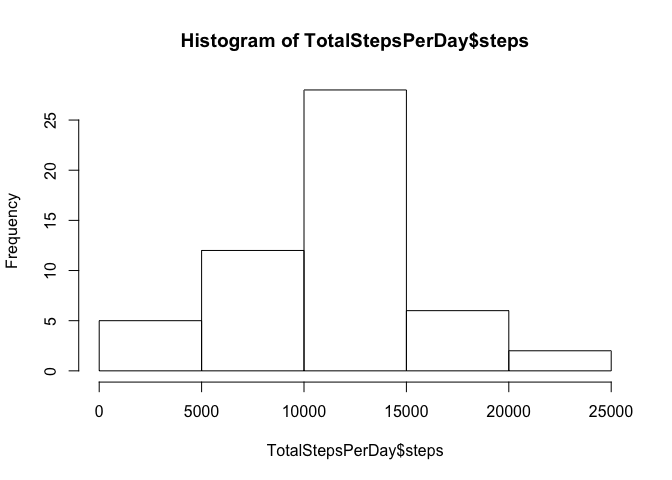
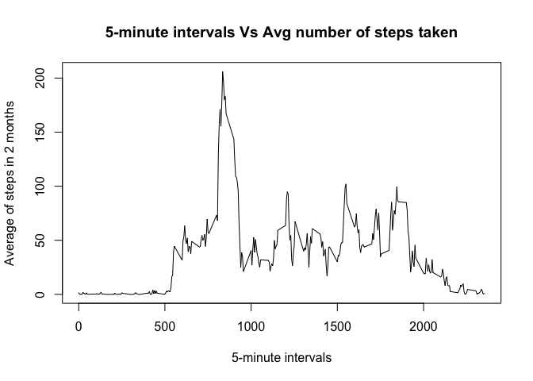
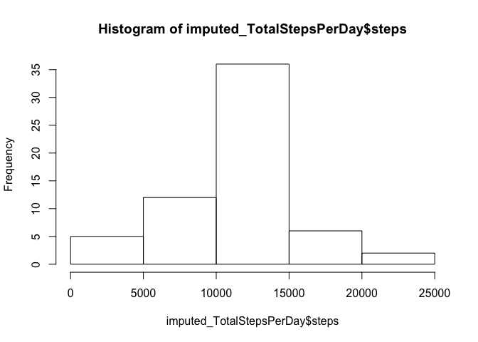
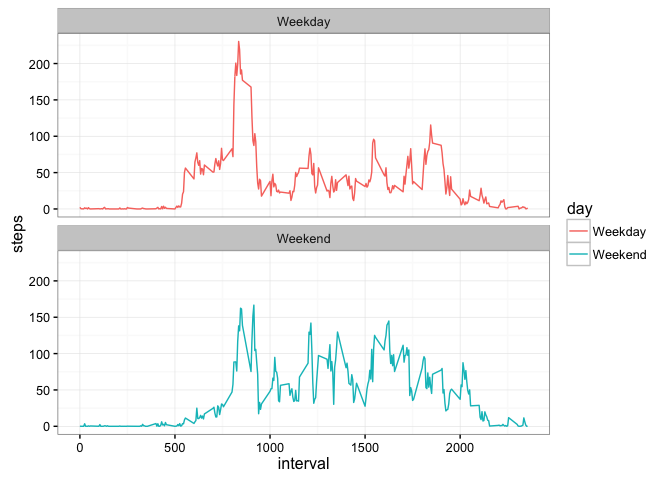

# Reproducible Research: Peer Assessment 1


## Loading and preprocessing the data
Get the data in your working directory and load it into a dataframe.


```r
activity <- read.csv("activity.csv")
#change date column to date class
activity$date <- as.Date(activity$date, "%Y-%m-%d")
```


## What is mean total number of steps taken per day?
First we'll create a histogram of the total steps taken per day in the span of 2 months.


```r
TotalStepsPerDay <- aggregate(steps ~ date, activity, sum)
hist(TotalStepsPerDay$steps)
```

<!-- -->

The mean of total steps taken per day is :

```r
mean(TotalStepsPerDay$steps)
```

```
## [1] 10766.19
```

And the median of total steps taken per day is :

```r
median(TotalStepsPerDay$steps)
```

```
## [1] 10765
```

## What is the average daily activity pattern?
Below plot shows the pattern of avg steps taken for a 5 minute interval. 

```r
MeanStepsPerInterval <- aggregate(steps ~ interval, activity, mean)
plot(MeanStepsPerInterval$interval, MeanStepsPerInterval$steps, 
     type = "l", 
     xlab = "5-minute intervals", 
     ylab = "Average of steps in 2 months", 
     main = "5-minute intervals Vs Avg number of steps taken")
```

<!-- -->

The interval with max steps is :

```r
MeanStepsPerInterval[which.max(MeanStepsPerInterval$steps),]
```

```
##     interval    steps
## 104      835 206.1698
```

## Imputing missing values
The strategy we'll use to impute missing data is - fill an NA with the Mean of steps for that interval it is recorded in.

First we calculate the total number of NAs

```r
sum(is.na(activity$steps))
```

```
## [1] 2304
```

We impute missing data with the strategy described above.

```r
# Replace na with Mean of that interval 
imputed_activity <- transform(activity, steps = ifelse(is.na(activity$steps), 
                                                MeanStepsPerInterval$steps[match(activity$interval, MeanStepsPerInterval$interval)], 
                                                activity$steps))
```

Now we calculated the total steps taken per day with this dataset having all data

```r
imputed_TotalStepsPerDay <- aggregate(steps ~ date, imputed_activity, sum)
hist(imputed_TotalStepsPerDay$steps)
```

<!-- -->

```r
mean(imputed_TotalStepsPerDay$steps)
```

```
## [1] 10766.19
```

The mean and median of total steps per day for this completed dataset.

```r
mean(imputed_TotalStepsPerDay$steps)
```

```
## [1] 10766.19
```

```r
median(imputed_TotalStepsPerDay$steps)
```

```
## [1] 10766.19
```

The difference between mean and median of incomplete and complete (imputed) data is :

```r
mean(imputed_TotalStepsPerDay$steps) - mean(TotalStepsPerDay$steps)
```

```
## [1] 0
```

```r
median(imputed_TotalStepsPerDay$steps) - median(TotalStepsPerDay$steps)
```

```
## [1] 1.188679
```

## Are there differences in activity patterns between weekdays and weekends?
1. We'll first add a factor variable called day which specifies whether the date of recording data was a Weekday or a Weekend.
2. Then we group the data by Interval and Day and get the mean of steps for these groups.
3. Create a ggplot to show the pattern of steps for given intervals, for Weekends and Weekdays


```r
library(dplyr)
```

```
## 
## Attaching package: 'dplyr'
```

```
## The following objects are masked from 'package:stats':
## 
##     filter, lag
```

```
## The following objects are masked from 'package:base':
## 
##     intersect, setdiff, setequal, union
```

```r
library(ggplot2)
tmpDays <- weekdays(activity$date)
weekendDays <- c("Saturday", "Sunday")
tmpDays <- ifelse(is.element(tmpDays, weekendDays), "Weekend", "Weekday")
imputed_activity$day <- as.factor(tmpDays)
groupByIntervalDay_activity <- imputed_activity %>% group_by(interval, day) %>% summarise(steps = mean(steps))

g <- ggplot(groupByIntervalDay_activity, aes(interval, steps, color = day))
g + geom_line() + theme_bw() +  facet_wrap(~day, ncol = 1, nrow=2)
```

<!-- -->
